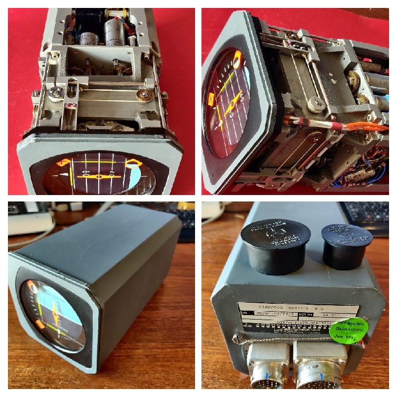
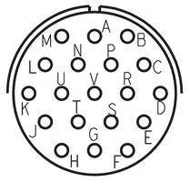
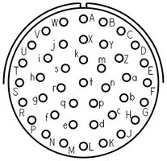

# Aviation_Smiths_Horizon_H6
Smiths Industries Flight Director Horizon H6

[More info from Amateurtele.com](http://amateurtelecom.reiding.com/index.php?artikel=340)

## Devices

|Index|Chanell   |Purpose|
|-----|----------|-------|
|A    |Roll      |Motor  |
|B    |Pitch     |Motor  |
|C    |Roll      |Syn Rx |
|D    |Roll      |Syn Tx |
|E    |Pitch     |Syn Tx |
|F    |Pitch     |Syn Rx |
|G    |Horizontal|Syn Tx |
|H    |Roll      |Syn Tx |
|I    |Pitch     |Syn Tx |
|J    |Vertical  |Syn Tx |
|K    |Horizontal|Motor  |
|L    |Vertical  |Motor  | 

 
### device map

|     |     |     |     |
|-----|-----|-----|-----|
|  .  |  L  |  K  |  .  |
|  J  |  I  |  H  |  G  |
|  F  |  E  |  D  |  C  |
|  X  |  B  |  A  |  O  |

## DH2 Small 19 way connector

### pin summary

|Pin Nos ||Function|
|--------|--------|----------|
|G-H-J|3x 26R     |Syn I     |
|B-C-D|3x 25R     |Syn H     |
|P-R-E|179R-210R  |Ref H     |
|V-S-F|Wfrjs-VSF  |Common    |
|K-U-T|150R-150R  |Ref I     |
|M-N  |692R       |X flag    |

  * V-S-F common joins to Common on DH2
  * Ref inputs higher resistance to Ref inputs on DH2 (115v maybe)

### pin map

 

|Pin No|     |Function|
|-----|-----|-----|
|   A |n/c     |n/a       |
|   B |25R     |Syn H     |
|   C |25R     |Syn H     |
|   D |25R     |Syn H     |
|   E |340R    |Ref H     |
|   F |V-S-F   |Common    |
|   G |26R     |Syn I     |
|   H |26R     |Syn I     |
|   J |26R     |SYn I     |
|   K |150R    |Ref I     |
|   L |n/c     |n/a       |
|   M |Red 692R  |O flag  |
|   N |Black 692R|O flag  |
|   P |340R    |Ref H     |
|   R |340R    |Ref H     |
|   S |V-S-F   |Common    |
|   T |150R    |Ref I     |
|   U |150R    |Ref I     |
|   V |V-S-F   |Common    |

 

## DH1 Large 41 way connector 

### pin summary

|Pin Nos|Function|Resistance|
|-------|--------|----------|
|W-A| power supply, 115VAC 400Hz|
|L-M-e|synchro ROLL| 3x 205R |
|J-H-c|synchro PITCH| 3x 199R |
|D-Y-Z|synchro DYZ|3x 19R a|
|B-C|Ref BC|53R|
|E-F|Ref EF|53R c|
|X-k|Lamps|3R|
|t-m-a|synchro tma|3x 19R b|
|P-R|Line Ref PR|50R|
|S-U|Line Vertical|14k|
|T-U|Line Horizontal|14k|
|U-N|?|res to chassis(varies)|
|W-f-r-s-j||Common|
|g-h|X flag|715R|

 * Lamps 5V
 * Flags 12 to 26V DC
 * Main power 115 V 400 Hz
 * Synchro resolver inputs 11V 400 Hz ?

 

### pin map 

 

|Pin No|     |Function|
|-----|-----|-----|
|   A |49R    |115 VAC    |
|   B |53R    |Roll Ref   |
|   C |53R    |Roll Ref   |
|   D |19Ra   |Roll Out   |
|   E |53Rc   |Pitch Ref  |
|   F |53Rc   |Pitch Ref  |
|   G |n/c    |n/a        |
|   H |199R   |Syn PITCH  |
|   J |199R   |Syn PITCH  |
|   K |n/c    |n/a        |
|   L |205R   |Syn ROLL   |
|   M |205R   |Syn ROLL   |
|   N |Chassis|Chassis    |
|   P |50R    |Line Ref in|
|   R |50R    |Line Ref in|
|   S |14k -U |Vertical   |
|   T |14k -U |Horizontal |
|   U |U-N res|H/V low ?  |
|   V |n/c    |n/a        |
|   W |Wfrsj  |Common     |
|   X |3R     |Lamp-b     |
|   Y |19Ra   |Roll Out   |
|   Z |19Ra   |Roll Out   |
|   a |19Rb   |Pitch Out  |
|   b |n/c    |n/a        |
|   c |199R   |PITCH      |
|   d |n/c    |n/a        |
|   e |205R   |ROLL       |
|   f |Wfrsj  |Common     |
|   g |715R Black|X flag  |
|   h |715R Red  |X flag  |
|   i |n/c    |n/a        |
|   j |Wfrsj  |Common     |
|   k |3R     |Lamp-a     |
|   m |19Rb   |Pitch Out  |
|   n |n/c    |n/a        |
|   p |n/c    |n/a        |
|   q |n/c    |n/a        |
|   r |Wfrsj  |Common     |
|   s |Wfrsj  |Common     |
|   t |19Rb   |Pitch Out  |

